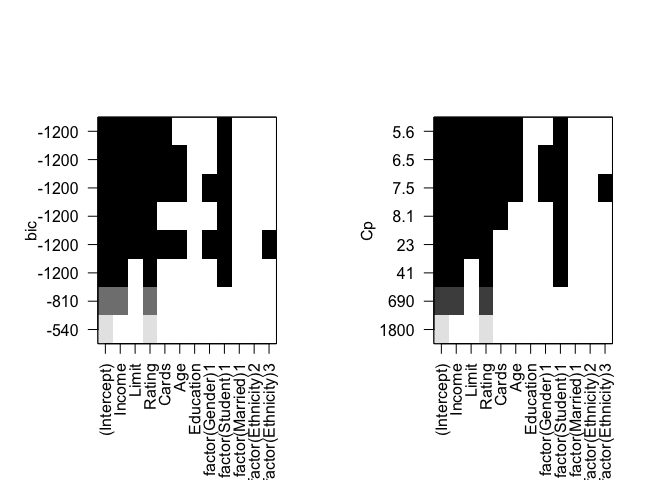

### Question 2

    rm(list = ls())
    library(leaps)
    library(ggplot2)

    Data = read.csv("/Users/Hongbo/Documents/R data/Credit.csv", header = TRUE, as.is = TRUE)
    Data[Data[ , 'Gender'] == unique(Data$Gender)[1], 'Gender'] <- 1
    Data[Data[ , 'Gender'] == unique(Data$Gender)[2], 'Gender'] <- 0

    Data[Data[ , 'Student'] == unique(Data$Student)[1], 'Student'] <- 0
    Data[Data[ , 'Student'] == unique(Data$Student)[2], 'Student'] <- 1

    Data[Data[ , 'Married'] == unique(Data$Married)[1], 'Married'] <- 1
    Data[Data[ , 'Married'] == unique(Data$Married)[2], 'Married'] <- 0

    Data[Data[, 'Ethnicity'] == unique(Data$Ethnicity)[1], 'Ethnicity'] <- 1
    Data[Data[, 'Ethnicity'] == unique(Data$Ethnicity)[2], 'Ethnicity'] <- 2
    Data[Data[, 'Ethnicity'] == unique(Data$Ethnicity)[3], 'Ethnicity'] <- 3

    reg_1 <- regsubsets(Balance ~ Income + Limit + Rating + Cards + Age + Education + 
                          factor(Gender) + 
                          factor(Student) + 
                          factor(Married) + 
                          factor(Ethnicity), data = Data)

    reg_for <- regsubsets(Balance ~ Income + Limit + Rating + Cards + Age + Education + 
                            factor(Gender) + 
                            factor(Student) + 
                            factor(Married) + 
                            factor(Ethnicity), data = Data, method = 'forward')

    reg_back <- regsubsets(Balance ~ Income + Limit + Rating + Cards + Age + Education + 
                             factor(Gender) + 
                             factor(Student) + 
                             factor(Married) + 
                             factor(Ethnicity), data = Data, method = 'backward')

### 1.

    numofvar = 1:8
    rss <- data.frame(numofvar, summary(reg_1)$rss, summary(reg_for)$rss, summary(reg_back)$rss )
    colnames(rss) <- c("number of variables", "Best Subset Selection", "Forward Stepwise Selection", "Backward Stepwise selection")
    ggplot(data = rss, aes(x = rss$`number of variables`)) +
      geom_line(mapping = aes( y = rss$`Best Subset Selection`/100, col = "Best Subset Selection"), alpha = 1) +
      geom_line(mapping = aes( y = rss$`Forward Stepwise Selection`/100, col = "Forward Stepwise Selection"), alpha = 0.5)+ 
      geom_line(mapping = aes( y =  rss$`Backward Stepwise selection`/100, col = "Backward Stepwise selection"), alpha = 0.5) + 
      geom_point(mapping = aes( y = rss$`Best Subset Selection`/100, col = "Best Subset Selection"), alpha = 1) +
      geom_point(mapping = aes( y = rss$`Forward Stepwise Selection`/100, col = "Forward Stepwise Selection"), alpha = 0.5)+ 
      geom_point(mapping = aes( y =  rss$`Backward Stepwise selection`/100, col = "Backward Stepwise selection"), alpha = 0.5) +
      labs(title = "RSS", x = "number of variables", y = "RSS", color = "Legend Title\n") +
      scale_color_manual(values = c("blue", "red", "green"))

### 2.

##### Best Subset Selection

    par(mfrow=c(1,2))
    plot(reg_1, scale = "bic")
    plot(reg_1, scale = "Cp")

For the *'Best Subset Selection'*, the optimal model for using **BIC**
is the model contains predictors: **Income, Limit, Cards and Student\_1
(Yes)**; the optimal model for using **Cp** is that contains predictors:
**Income, Limit, Rating, Cards, Age and Student\_1 (Yes)**;

##### b. Forward Stepwise Selection

    par(mfrow=c(1,2))
    plot(reg_for, scale = "bic")
    plot(reg_for, scale = "Cp")

For the *'Forward Stepwise Selection'*, the optimal model for using
**BIC** is the model contains predictors: **Income, Limit, Rating and
Student\_1 (Yes)**; the optimal model for using **Cp** is that contains
predictors: **Income, Limit, Rating, Cards, Age and Student\_1 (Yes)**;

##### c. Backward Stepwise selection

    par(mfrow=c(1,2))
    plot(reg_back, scale = "bic")
    plot(reg_back, scale = "Cp")

For the *'Backward Stepwise selection'*, the optimal model for using
**BIC** is the model contains predictors: **Income, Limit, Cards and
Student\_1 (Yes)**; the optimal model for using **Cp** is that contains
predictors: **Income, Limit, Rating, Cards, Age and Student\_1 (Yes)**;

**BIC** always tends to select a model with less predictors when compare
to **Cp** in all these three models.

### Question 3

##### 1.

    ## Download Data by Python 
    rm(list = ls())
    names <- read.csv("/Users/Hongbo/Documents/R data/PCA/name.csv", header = FALSE, as.is = TRUE)

    Close_Price <- data.frame(matrix(nrow = 252, ncol = 1))

    ## Read and Combine Data
    for (i in 1:dim(names)[1]){
      location <- paste("/Users/Hongbo/Documents/R data/PCA/", names[i,"V1"], ".csv", sep = "")
      Data <- read.csv(location, header= TRUE)
      Close_Price[, i] <- Data$Close
      colnames(Close_Price)[i] <- names[i, "V1"]
    }
    Close_Price$Time <- Data$Date
    Close_Price <- Close_Price[, c(ncol(Close_Price), 1:(ncol(Close_Price) - 1))]

##### 2.

    pca_price <- princomp(Close_Price[, 2:ncol(Close_Price)], cor = FALSE)
    biplot(pca_price)

    screeplot(pca_price)

From the **bipolt**, the first component are mostly made by the stock
*APL*, and all stocks are almost equally important in the second
component. In the screeplot, the first component seems to explain a lot
of variance. Horever, since there are still a lot of variance cannot be
explained by the first component (about 250, which is relatively high),
for this PCA model, we need the first two components, three maybe
better.

It's not a good choice (PCA on covariance) since these stocks are
selected from a same group (Dow Jones), which means they are highly
correlated with each other. In this kind of situation, a proper model
should be PCA on correlation.

##### 3.

    pca_price <- princomp(Close_Price[, 2:ncol(Close_Price)], cor = TRUE)
    biplot(pca_price)

    screeplot(pca_price)

In this case, we used the model PCA on correlation, which makes these
stocks influence the principle components equally. In screeplot,
variance mostly are explained by the first three principle components,
then we might want to keep the first three princeple component.

##### 4.

    returnCal <- function(data){
      result <- rep(NA)
      for (i in length(data):2){
        result[i-1] <- (data[i] - data[i-1])/data[i]
      }
      return (result)
    }

    return_matrix <- data.frame(apply(Close_Price[, 2:ncol(Close_Price)], 2, returnCal))
    return_matrix$Time <- Data$Date[2:nrow(Data)]
    return_data <- return_matrix[, c(ncol(return_matrix), 1:(ncol(return_matrix) - 1))]

    pca_return <- princomp(return_data[, 2:ncol(return_data)], cor = TRUE)
    biplot(pca_return)

    screeplot(pca_return)

Since all stocks are equally important in the first two principle
components and the first component can explain most of variance in
screeplot, we can say these stocks are highly correlated.

If these stocks are change independently, we will need more principle
components to explain the variance. The screeplot will become a more
smoother curve than this one.
