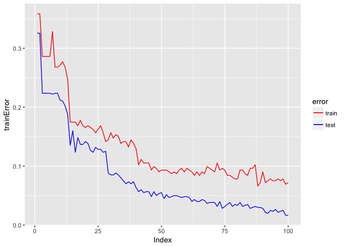

    ## data Processing
    train_3 <- read.csv("/Users/Hongbo/Documents/R data/train_3.txt")
    colnames(train_3) <- c(1:ncol(train_3))
    train_3$y <- rep(-1, nrow(train_3))
    train_8 <- read.csv("/Users/Hongbo/Documents/R data/train_8.txt")
    colnames(train_8) <- c(1:ncol(train_8))
    train_8$y <- rep(1, nrow(train_8))
    train_data <- rbind(train_3, train_8)
    train_x <- train_data[, 1:(ncol(train_data) -1)]
    train_y <- train_data[, ncol(train_data)]

    test <- read.csv("/Users/Hongbo/Documents/R data/zip_test.txt", sep = ' ')
    test_data <- test[which(test$X9 == 3 | test$X9 == 8), ]
    test_data_y <- test_data$X9
    test_data <- test_data[, -1]
    colnames(test_data) = seq(1, ncol(test_data))
    test_data$y <- test_data_y
    test_data[which(test_data$y == 3), 'y'] = -1
    test_data[which(test_data$y == 8), 'y'] = 1
    test_x <- test_data[, 1:ncol(test_data) - 1]
    test_y <- test_data$y

    ## adaboost
    adaboost<-function(x,y,B){
      alpha <- rep(0,B)
      allPars <- rep(list(list()),B)
      n <- nrow(x)
      w <- rep(1/n, times=n)
      
      for (b in 1:B){
        allPars[[b]] <- train(x,w,y) 
        missclass <- as.numeric(y != classify(x,allPars[[b]])) 
        error <- (w %*% missclass/sum(w))[1]
        alpha[b] <- log( (1-error)/error ) 
        w <- w * exp(alpha[b]*missclass) 
      }
      return(list(allPars=allPars,alpha=alpha))
    } 

    ## agg_class
    agg_class <- function(x,alpha,allPars){
      n <- nrow(x)
      B <- length(alpha)
      labels <- matrix(0,nrow=n,ncol=B)
      
      for (b in 1:B){
        labels[,b] <- classify(x,allPars[[b]])
      }
      
      labels <- labels %*% alpha
      c_hat <- sign(labels)
      return(c_hat)
    }

    ## train
    train<-function(x,w,y){
      n<-nrow(x)
      met <- matrix(nrow = ncol(x))
      theta <- matrix(nrow = ncol(x))
      loss <- matrix(nrow = ncol(x))
      
      for (j in 1:ncol(x)){
        index <- order(x[,j])
        x_j <- x[index,j]
        w_cum <- cumsum(w[index]*y[index]) 
        w_cum[ duplicated(x_j) == 1] <- NA 
        m <- max(abs(w_cum), na.rm=TRUE) 
        maxIndex <- min( which(abs(w_cum) == m))
        met[j] <- (w_cum[maxIndex]<0)*2 - 1
        theta[j] <- x_j[maxIndex]
        c <- ((x_j > theta[j])*2 - 1) * met[j]
        loss[j] <- w %*% (c!=y)
      }
      
      m <- min(loss)
      j_opt <- min(which(loss == m))
      pars <- list(j=j_opt, theta=theta[j_opt], mode=met[j_opt])
      return(pars)
    }

    ## classify
    classify<-function(x,pars){
      j <- pars$j
      t <- pars$theta
      m <- pars$mode
      l <- x[,j]
      pred <- m * (l-t)
      pred[pred < 0] <- -1
      pred[pred >= 0] <- 1
      return(pred)
    }

    ## error
    n <- nrow(train_x)
    B_max <- 100
    nCV <- 5

    testErrorRate <- matrix(0,nrow=B_max, ncol=nCV)
    trainErrorRate <- matrix(0,nrow=B_max, ncol=nCV)

    for (i in 1:nCV){
      p <- sample.int(n)
      trainIndex <- p[1:round(n/2)]
      ada <- adaboost(train_x[trainIndex, ], train_y[trainIndex],B_max)
      allPars <- ada$allPars
      alpha <- ada$alpha
      
      for (B in 1:B_max){
        c_hat_test <- agg_class( test_x,alpha[1:B], allPars[1:B] )
        testErrorRate[B, i] <- mean(test_y != c_hat_test)
        c_hat_train <- agg_class(train_x[trainIndex,], alpha[1:B], allPars[1:B])
        trainErrorRate[B, i] <- mean(train_y[trainIndex] != c_hat_train)
      }
    }

    trainError <- rep(NA); testError <- rep(NA)
    for(i in 1:B_max){
      trainError[i] <- min(trainErrorRate[i,])
      testError[i] <- testErrorRate[i, which.min(trainErrorRate[i,])]
    }

    error_data <- data.frame(c(1:B_max), trainError, testError)
    colnames(error_data)[1] = "Index"
    # 4. Plot train error and test error
    library(ggplot2)
    ggplot(data = error_data) +
      geom_line(mapping = aes(x = Index, y = trainError, color = 'red')) +
      geom_line(mapping = aes(x = Index, y = testError, color = 'blue')) + 
      scale_color_manual(name = 'error', 
                         values = c("red", "blue"), 
                         labels = c('train', 'test'))

