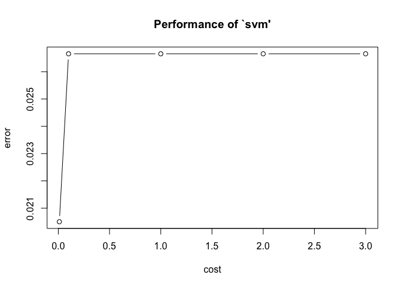
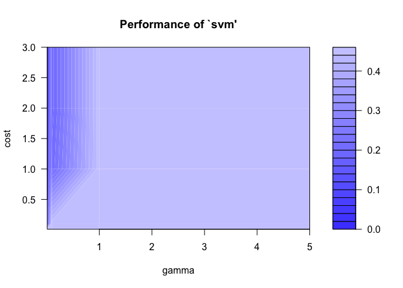

    rm(list = ls())
    library(e1071)
    Train_5 <- read.table("~/Documents/R data/train_5.txt", sep = ',')
    Train_6 <- read.table("~/Documents/R data/train_6.txt", sep = ',')
    Train_5[, ncol(Train_5) + 1] <- rep(-1, nrow(Train_5))
    Train_6[, ncol(Train_6) + 1] <- rep(1, nrow(Train_6))
    Data <- rbind(Train_5, Train_6)
    colnames(Data)[ncol(Data)] <- 'Y'
    Data$Y <- factor(Data$Y)

    # 20% Test 80% Training
    sample_Size <- nrow(Data) * 0.2
    sample_Index <- sample(1:nrow(Data), sample_Size)
    test_Data <- Data[sample_Index, ]
    train_Data <- Data[-sample_Index,]

    # svm_1
    svm_soft <- svm(Y~., data = train_Data, scale = FALSE, kernel = 'linear', cross = 8)

    svm_RBF <- svm(Y~., data = train_Data, scale = FALSE, kernel = 'radial', cross = 8)

    margin <- c( 0.01, 0.1, 1, 2, 3)
    gammaControl <- c(0.01, 0.1, 1, 5)
    tune_soft <- tune.svm(Y~., data = train_Data, 
                      cost = margin, scale = FALSE, kernel = 'linear') 
    plot(tune_soft)

    tune_RBF <- tune.svm(Y~., data = train_Data, 
                         cost = margin, gamma = gammaControl,
                         scale = FALSE, kernel = 'radial') 
    plot(tune_RBF)

    # 2
    1 - mean(predict(tune_soft$best.model, test_Data) == test_Data$Y)

    ## [1] 0.02459016

    1 - mean(predict(tune_RBF$best.model, test_Data) == test_Data$Y)

    ## [1] 0
