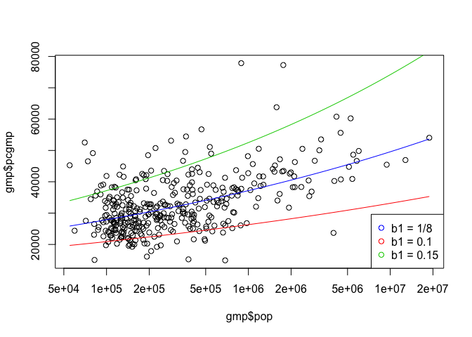
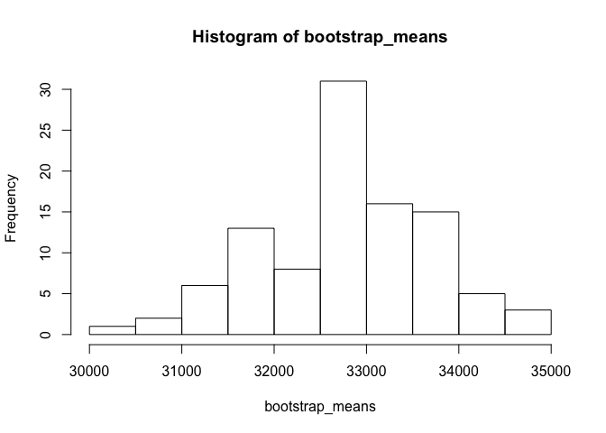

### i.

    rm(list = ls())
    gmp <- read.table("~/Desktop/R data/gmp.txt", head = TRUE)
    gmp$pop <- round(gmp$gmp / gmp$pcgmp)
    names(gmp)

    ## [1] "city"  "gmp"   "pcgmp" "pop"

    plot(y = gmp$pcgmp, x = gmp$pop, log = "x")
    curve(6611*x^(1/8), add = TRUE, col = "blue")     # b0 = 6611, b1 = 1/8
    curve(6611*x^(0.1), add = TRUE, col = "red")
    curve(6611*x^(0.15), add = TRUE, col = 3)
    legend("bottomright", legend = c("b1 = 1/8", "b1 = 0.1", "b1 = 0.15"), 
           col=c("blue", "red", 3), pch = 1)

### ii.

    mse <- function(r = c(b0, b1), X = gmp$pop, Y = gmp$pcgmp){
      sse <- sum( ( Y - r[1]*(X^r[2]) ) ^2 )
      mse <- sse / length(X)
      return(mse) 
    }
    mse(c(6611, 0.15))

    ## [1] 207057513

    mse(c(5000, 0.1))

    ## [1] 298459914

### iii.

    nlm(mse, c(beta0 = 6611, beta1 = 1/8))

    ## $minimum
    ## [1] 61857060
    ## 
    ## $estimate
    ## [1] 6611.0000000    0.1263177
    ## 
    ## $gradient
    ## [1] 50.048639 -9.976327
    ## 
    ## $code
    ## [1] 2
    ## 
    ## $iterations
    ## [1] 3

    nlm(mse, c(beta0 = 6611, beta1 = 0.1))

    ## $minimum
    ## [1] 61857060
    ## 
    ## $estimate
    ## [1] 6611.0000003    0.1263177
    ## 
    ## $gradient
    ## [1]   50.04683 -166.46087
    ## 
    ## $code
    ## [1] 2
    ## 
    ## $iterations
    ## [1] 6

    nlm(mse, c(beta0 = 6611, beta1 = 0.15))

    ## $minimum
    ## [1] 61857060
    ## 
    ## $estimate
    ## [1] 6610.9999997    0.1263182
    ## 
    ## $gradient
    ## [1]   51.76354 -210.18937
    ## 
    ## $code
    ## [1] 2
    ## 
    ## $iterations
    ## [1] 7

    nlm(mse, c(beta0 = 6611, beta1 = 1/8))$estimate

    ## [1] 6611.0000000    0.1263177

### iv.

    plm <- function(b0, b1, X = gmp$pop, Y = gmp$pcgmp){
      est_b0 <- nlm(mse, c(b0, b1))$estimate[1]
      est_b1 <- nlm(mse, c(b0, b1))$estimate[2]
      est_MSE <- nlm(mse, c(b0, b1))$minimum
      return(c(est_b0, est_b1, est_MSE))
    }
    plm(6611, 0.15)

    ## [1] 6.611000e+03 1.263182e-01 6.185706e+07

    plm(5000, 0.10)

    ## [1] 5.000000e+03 1.475913e-01 6.252148e+07

We can see that the data parameter estimated when starting from *β0 =
6611*, *β1 = 0.15* and from *β0 = 5000* and *β1 = 0.10* are not the
same. The reason is most data are located in the range (5e+04, 2e+07),
which is really far from the origin. So the affecting from *β0*, the
*y-interval* is negligible. Different *β0* will return to a
correspondent *β1*.

In this question, *β0 = 6611*, *β1 = 0.15* returns 6.185706*e* + 07 and
*β0 = 5000* and *β1 = 0.10* returns 6.252148*e* + 07. So *β0 = 6611*,
*β1 = 0.15* have a smaller *MSE*.

### v.

### (a).

    xbar <- mean(gmp$pcgmp); std_x <- sd(gmp$pcgmp)
    n <- length(gmp$pcgmp)
    (sem <- std_x / sqrt(n))

    ## [1] 481.9195

### (b).

    indices <- function(ind = vector(mode = "numeric"), 
                        X = gmp$pcgmp){
      mean_ind <- mean(X[ind])
      return(mean_ind)  
    }

### (c).

    bootstrap_means <- vector(length = 100)
    for(i in 1:100){
      index <- sample(1:length(gmp$pcgmp), 100, replace = TRUE)
      bootstrap_means[i] <- indices(index)
    }

### (d).

    (sem_bootstrap <- sd(bootstrap_means))

    ## [1] 899.4539

The value is not closed to the value in part (a). The reason for that is
because the size of B is too small, so the distribution of bootstrap
mean does not fit the normal distribution very well. We can see that
from the picture.

    hist(bootstrap_means)

### (vi).

    plm <- function(b0, b1, X, Y){
      mse <- function(r = c(b0, b1)){
        sse <- sum( ( Y - r[1]*(X^r[2]) ) ^2 )
        mse <- sse / length(X)
        return(mse)}
      est_b0 <- nlm(mse, c(b0, b1))$estimate[1]
      est_b1 <- nlm(mse, c(b0, b1))$estimate[2]
      est_MSE <- nlm(mse, c(b0, b1))$minimum
      return(c(est_b0, est_b1, est_MSE))
    }

    plm_bootstrap <- function(b0, b1, X = gmp$pop, Y = gmp$pcgmp, B = 100){
      b0_boot <- vector(length = B)
      b1_boot <- vector(length = B)
      for(i in 1:B){
        index <- sample(1:length(X), B , replace = TRUE)  
        b0_boot[i] <- plm(b0, b1, X[index], Y[index])[1]
        b1_boot[i] <- plm(b0, b1, X[index], Y[index])[2]
      }
      return(c(sd(b0_boot), sd(b1_boot)))
    }

    plm_bootstrap(6611, 0.15)

    ## [1] 2.476209e-08 1.813297e-03

    plm_bootstrap(5000, 0.10)

    ## [1] 3.778265e-08 1.945256e-03

### (vii).

    gmp_2013 <- read.table("~/Desktop/R data/gmp-2013.txt", head = TRUE)
    gmp_2013$pop <- round(gmp_2013$gmp / gmp_2013$pcgmp)

    plm_bootstrap <- function(b0, b1, X = gmp_2013$pop, Y = gmp_2013$pcgmp, B = 100){
      b0_boot <- vector(length = B)
      b1_boot <- vector(length = B)
      for(i in 1:B){
        index <- sample(1:length(X), B , replace = TRUE)  
        b0_boot[i] <- plm(b0, b1, X[index], Y[index])[1]
        b1_boot[i] <- plm(b0, b1, X[index], Y[index])[2]
      }
      return(c(sd(b0_boot), sd(b1_boot)))
    }

    plm(6611, 0.15, gmp_2013$pop, gmp_2013$pcgmp)

    ## [1] 6.611000e+03 1.433688e-01 1.352105e+08

    plm_bootstrap(6611, 0.15)

    ## [1] 2.521933e-08 2.109370e-03

As we see in the result, the standard deviation of the estimated
parameters in the data set *gmp* and *gmp\_2013* are closed. The
estimated parameter we got from previous question are 6611.0000000 and
0.1263177, and this time we have the estimated parameter 6611 and
0.1433688. Since they are really closed, the parameters of the model
does not changed significantly.
