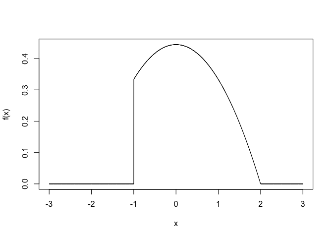

### Part 1: Inverse Transform Method

### 1.

    rm(list = ls())
    Data <- read.csv("~/Desktop/R data/wtid-report.csv", header = T)
    colnames(Data) <- c("Country", "Year", "P99", "P99.5", "P99.9")
    x_min <- Data[Data$Year == 2015, "P99"]
    a_hat <- 2.654

    f <- function(x, a = a_hat, xmin = x_min){
      fx <- ((a - 1)/xmin) * ((x/xmin)^(-a))
      return( ifelse( (x < xmin), -Inf, fx) )
    }

    x <- x_min:1000000
    plot(x, f(x), type = "l")

### 2.

    upper_income <- function(u, a = a_hat, xmin = x_min){
      Fx <- xmin * ((1 - u)^(1/(1-a))) 
      return( ifelse( (u < 0 | u > 1) , -Inf, Fx) )
    }
    upper_income(0.5)

    ## [1] 620020.2

### 3.

    n_sam = 1000   # number of sample
    u <- runif(n_sam)
    x <- upper_income(u)

    hist(x, prob = TRUE, breaks = 20)
    x_lab <- seq(0, max(x), 100)
    lines(x_lab, f(x_lab), col = 2)
    legend("topright", c("Simulated value", "Pareto density"), col = c(1, 2), pch = c(1,1))

### 4.

    x_med_sim <- median(x)

    prob = 0.5
    x_med_dis <- x_min * ((prob) ^ (1 / (1 - a_hat)))
    cat("from simulation", x_med_sim, "\nby function", x_med_dis)

    ## from simulation 615658.6 
    ## by function 620020.2

### Part 2: Reject-Accept Method

### 5.

    rm(list = ls())

    f <- function(x){
      f <- (1/9) * (4 - x^2)
      return(ifelse((x <= -1 | x >= 2), 0, f))
    }

    x <- seq(-3, 3, by = 0.001)
    plot(x, f(x), type = "l")

### 6.

Derive the derivative of the function *f*(*x*), we get $\\frac{2}{9}x$.
So when *x* = 0, we get the maximum of the function *f*(*x*).

    # max when f'(x) = 0 ==> x = 0
    f_max <- f(0)

    e <- function(x){  
      return(ifelse((x < -1 | x > 2), Inf,  f_max))
    }

    plot(x, f(x), type = "l")
    lines(c(-1, -1), c(0, e(-1)), col = 2)
    lines(c(2, 2), c(0, e(2)), col = 2)
    lines(x, e(x), col = 2 )

### 7.

    n_samp <- 1000
    i = 0
    samps <- rep(NA)
    while(i < n_samp){
      y <- runif(1, min = -1, max = 2)
      u <- runif(1)
      if( u <= f(y)/e(y)){
        i = i + 1
        samps[i] <- y
      } 
    }

### 8.

    hist(samps, prob = TRUE)
    lines(x, f(x), col = 2)
    legend("topright", c("simulated", "density function"), col = c(1, 2), pch = 1)

### Part 3: Simulation with Built-in R Functions

### 9.

    x <- 5
    x_vals <- c()
    while(x > 0){
      r <- runif(1, min = -2, max = 1)
      x <- x + r
      if(x > 0){x_vals <- c(x_vals, x)}
    }
    x_vals

    ## [1] 4.210155 3.352254 2.256891 1.660226 1.019598

### 10.

    plot(x_vals, xlab = "iterations", ylab = "x value", type = "o")

### 11.

    random_walk <- function(x_start = 5, plot_walk = TRUE){
      x <- x_start
      iteration <- 0
      x_vals <- c()
      while(x > 0){
        r <- runif(1, min = -2, max = 1)
        x <- x + r
        if(x > 0){x_vals <- c(x_vals, x)}
        iteration <- iteration + 1
      }
      if(plot_walk == TRUE){
        plot(x_vals, xlab = "iterations", ylab = "x value", type = "o")
      }
      return(c(data.frame(x_vals), data.frame(iteration)))
    }
    random_walk()

    ## $x_vals
    ##  [1] 4.5896477 4.1697183 2.8314254 3.3146175 3.9053751 2.1311621 1.0201073
    ##  [8] 0.8586358 0.5936150 0.7440842 0.7920965 0.6988679 1.1973791
    ## 
    ## $iteration
    ## [1] 14

    random_walk()

    ## $x_vals
    ##  [1] 5.7413378 4.0725154 3.6896232 3.0436019 2.9903773 1.5354790 1.9743839
    ##  [8] 2.3984961 2.4772183 3.3328470 2.1450861 2.1209926 1.9035826 0.5348492
    ## [15] 0.5224785 0.7293590
    ## 
    ## $iteration
    ## [1] 17

    random_walk <- function(x_start = 10, plot_walk = FALSE){
      x <- x_start
      iteration <- 0
      x_vals <- c()
      while(x > 0){
        r <- runif(1, min = -2, max = 1)
        x <- x + r
        if(x > 0){x_vals <- c(x_vals, x)}
        iteration <- iteration + 1
      }
      if(plot_walk == TRUE){
        plot(x_vals, xlab = "iterations", ylab = "x value", type = "o")
      }
      return(c(data.frame(x_vals), data.frame(iteration)))
    }
    random_walk()

    ## $x_vals
    ##  [1] 8.3998838 7.4631879 7.8903546 6.8172117 4.8897162 4.9565557 2.9778536
    ##  [8] 1.6368402 2.5787686 2.8800400 1.5592853 1.5497969 2.3665984 0.8749101
    ## 
    ## $iteration
    ## [1] 15

    random_walk()

    ## $x_vals
    ## [1] 8.771432 7.860724 7.686900 7.541058 6.166681 5.080623 3.448573 3.191602
    ## [9] 1.597434
    ## 
    ## $iteration
    ## [1] 10

### 12.

    random_walk <- function(x_start = 5, plot_walk = FALSE){
      x <- x_start
      iteration <- 0
      x_vals <- c()
      while(x > 0){
        r <- runif(1, min = -2, max = 1)
        x <- x + r
        if(x > 0){x_vals <- c(x_vals, x)}
        iteration <- iteration + 1
      }
      if(plot_walk == TRUE){
        plot(x_vals, xlab = "iterations", ylab = "x value", type = "o")
      }
      return(c(data.frame(x_vals), data.frame(iteration)))
    }

    iter <- c(rep(NA, 10000))
    for(i in 1:10000){
      iter[i] <- random_walk()$iteration
    }
    mean(iter)

    ## [1] 11.1945

### 13.

    random_walk <- function(seed, x_start = 5, plot_walk = FALSE){
      if(!missing(seed)){
        set.seed(seed)
      }
      x <- x_start
      iteration <- 0
      x_vals <- c()
      while(x > 0){
        r <- runif(1, min = -2, max = 1)
        x <- x + r
        if(x > 0){x_vals <- c(x_vals, x)}
        iteration <- iteration + 1
      }
      if(plot_walk == TRUE){
        plot(x_vals, xlab = "iterations", ylab = "x value", type = "o")
      }
      return(c(data.frame(x_vals), data.frame(iteration)))

    }

    random_walk(33)

    ## $x_vals
    ## [1] 4.3378214 3.5217724 2.9729590 3.7295869 4.2612312 3.8132800 3.1246550
    ## [8] 2.1542497 0.2008006
    ## 
    ## $iteration
    ## [1] 10

    random_walk(33)

    ## $x_vals
    ## [1] 4.3378214 3.5217724 2.9729590 3.7295869 4.2612312 3.8132800 3.1246550
    ## [8] 2.1542497 0.2008006
    ## 
    ## $iteration
    ## [1] 10
