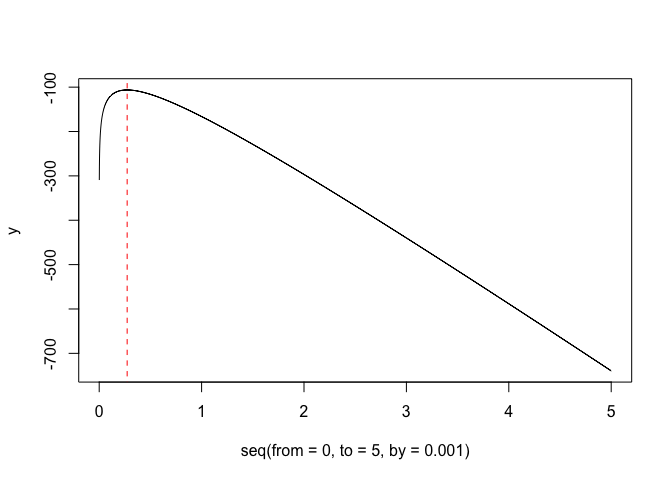

    rm(list = ls())
    Data <- read.csv("~/Desktop/R data/moretti.csv", header = TRUE)

### Part 1

### i.

    poisLoglik <- function(lambda, data){
      value <- sum( log(((lambda^(data)) * exp(-lambda))/factorial(data)) )
      return(value) 
    }

    data = c(1, 0, 0, 1, 1)
    poisLoglik(1, data)

    ## [1] -5

### ii.

    count_new_genres <- function(year){
      if(length(which(Data$Begin != year)) == 44){return(0)}
      else{return(length(which(Data$Begin == year)))}
    }

    count_new_genres(1803)

    ## [1] 0

    count_new_genres(1850)

    ## [1] 3

### iii.

    new_genres <- rep(NA)
    for(i in 1740:1900){
      new_genres[i - 1739] <- count_new_genres(i)
    }
    (pos_1803 <- 1803 - 1739) ; (pos_1850 <- 1850 - 1739)

    ## [1] 64

    ## [1] 111

    new_genres[pos_1803]; new_genres[pos_1850]

    ## [1] 0

    ## [1] 3

### iv.

    #poisLoglik_plot <- function(lambda, data = new_genres){
    #  return(sapply(seq(from = 0, to = 5, by = 0.001), poisLoglik, data = new_genres))}
    #curve(poisLoglik_plot(lambda = x), from = 0, to = 5)
    x <- seq(from = 0, to = 5, by = 0.001)
    y <- sapply(seq(from = 0, to = 5, by = 0.001), poisLoglik, data = new_genres)
    plot(seq(from = 0, to = 5, by = 0.001), y, type = 'l')
    index <- which(y == max(y))
    lines(c(x[index], x[index]), c(-800, max(y) + 50), col = 2, lty = 2)

    x[index]

    ## [1] 0.273

### v.

    poisLoglik <- function(lambda, data = new_genres){
      value <- sum( log(((lambda^(data)) * exp(-lambda))/factorial(data)) )
      return(-value) 
    }
    nlm(poisLoglik, p = 1)$estimate

    ## [1] 0.2732914

The MLE estimation is same as the plot we have at last question.

### vi.

    intergenre_intervals <- diff(Data$Begin)
    head(intergenre_intervals)

    ## [1]  8 11  7  2  2  3

    mean_ii <- mean(intergenre_intervals)
    std <- sd(intergenre_intervals)
    coefficient_of_variation <- std / mean_ii
    data.frame(mean_ii, std, coefficient_of_variation)

    ##   mean_ii      std coefficient_of_variation
    ## 1 3.44186 3.705224                 1.076518

### vii.

### a.

    sim_interval <- function(new_genres){
      new_year <- which(new_genres != 0)
      i_i <- c(NA)
      for(i in 2 : length(new_year)){
        i_i[i-1] <- new_year[i] - new_year[i-1]
      }
      return(i_i)
    }
    head(sim_interval(new_genres)); head(intergenre_intervals)

    ## [1]  8 11  7  2  2  3

    ## [1]  8 11  7  2  2  3

### b.

    sim_poisson <- function(num_year, lambda){
      sim_pois <- rpois(num_year, lambda)
      i_i <- sim_interval(sim_pois)
      cov <- sd(i_i) / mean(i_i)
      return(c(cov, i_i))
    }
    sim_1 <- sim_poisson(161, 0.273)
    sim_1[1]

    ## [1] 0.8377742

    mean(sim_1[-1])

    ## [1] 3.804878

The mean of the intervals does between 3 and 4.

### viii.

    sim_cov <- c(NA)
    for(i in 1:100000){
      sim_cov[i] <- sim_poisson(161, 0.273)[1]
    }
    length(sim_cov[sim_cov > coefficient_of_variation]) / length(sim_cov)

    ## [1] 0.05177

### ix.

We can see only a small portion of simulations runs have a higher
coefficient of variation than Moretti’s data, which means genres did
appear randomly, at a constant rate – a Poisson process. So the
conjecture that that genres tend to appear together in bursts is true.
