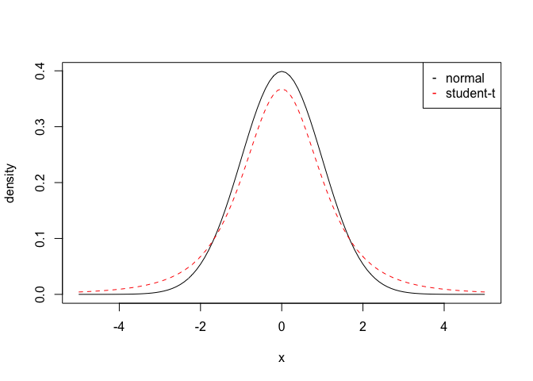
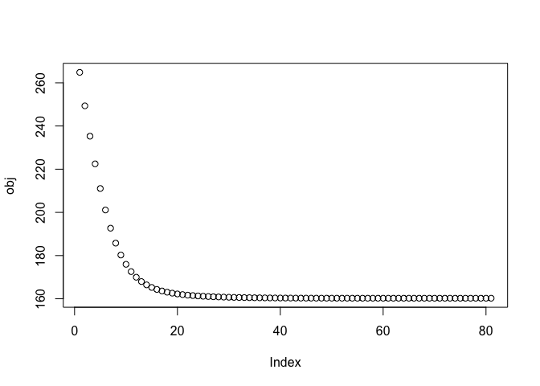
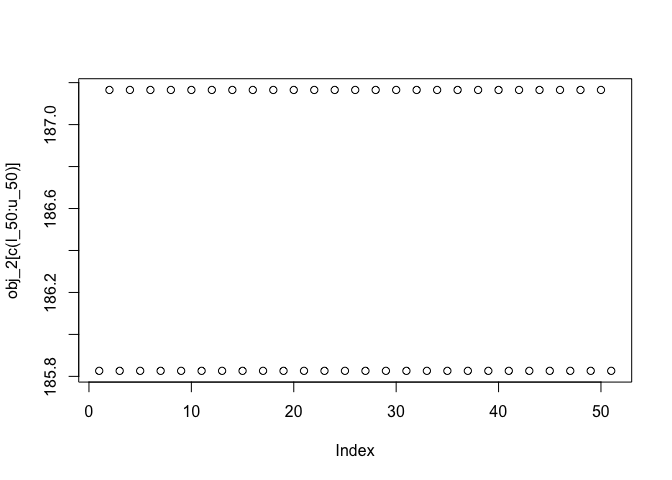

    rm(list = ls())

### 1.

    n <- 100
    p <- 10
    s <- 3
    #set.seed(0)
    x <- matrix(rnorm(n*p), n, p)
    b <- c(-0.7, 0.7, 1, rep(0, p-s))
    y <- x %*% b + rt(n, df=2)

    cor(x, y)

    ##              [,1]
    ##  [1,] -0.33167803
    ##  [2,]  0.19580199
    ##  [3,]  0.44177696
    ##  [4,] -0.07248735
    ##  [5,] -0.05051453
    ##  [6,] -0.04185582
    ##  [7,] -0.10176550
    ##  [8,] -0.04593001
    ##  [9,]  0.20320765
    ## [10,]  0.06279535

No, because here, the correlation coefficients does not show a strong
correlation between the predictor variables *x*1 to
*x*3 and the response y. Indeed, *x*4 and
*x*6 have a higher absolute value of the correlation
coefficient, but we know their linear coefficients should be zero.

### 2.

    curve(dnorm(x, mean = 0, sd = 1), from = -5, to = 5, 
          xlab = "x", ylab = "density")
    curve(dt(x, df = 3), from = -5, to = 5, col = 2, lty = 2, add = TRUE)
    legend("topright", c("normal", "student-t"), col = c(1, 2), pch ='-')

### 3.

    psi <- function(r, c = 1) {
      return(ifelse(r^2 > c^2, 2*c*abs(r) - c^2, r^2))
    }

    huber_loss <- function(beta){
      y_hat <- x %*% as.vector(t(beta))
      res <- y - y_hat
      return(sum(psi(res)))
    }

### 4.

    library(numDeriv)

    grad_descent <- function(f, x0, max.iter = 200, step.size = 0.001, stopping.deriv = 0.1, ...) { 
      n    <- length(x0)
      xmat <- matrix(0, nrow = n, ncol = max.iter)
      xmat[,1] <- x0
      for (k in 2:max.iter) {
        grad.cur <- grad(f, xmat[ ,k-1], ...) 
        if (all(abs(grad.cur) < stopping.deriv)) {
          k <- k-1; break
        }
        xmat[ ,k] <- xmat[ ,k-1] - step.size * grad.cur
      } 
      xmat <- xmat[ ,1:k]
      return(list(x = xmat[,k], xmat = xmat, k = k))
    }

    gd <- grad_descent(huber_loss, beta <- rep(0, p))
    cat("number of iterations: ", gd$k, "\n")

    ## number of iterations:  81

    gd$x

    ##  [1] -0.62261906  0.70001255  0.93336921 -0.14072127  0.15986564
    ##  [6] -0.01890178 -0.13525736 -0.23263538  0.16680747  0.05434723

### 5.

    obj <- rep(NA)
    for(i in 1:gd$k){
      obj[i] <- huber_loss(gd$xmat[, i]) 
    }
    plot(obj, type = "p")

As the picture shows, as the number of iteration increases, the effect
of the decreasing in the objective function decreases. i.e.
*Δ**o**b**j* ↓  *a**s* *i**t**e**r**a**t**i**o**n* ↑.

### 6.

    grad_descent <- function(f, x0, max.iter = 200, step.size = 0.01, stopping.deriv = 0.1, ...) { 
      n    <- length(x0)
      xmat <- matrix(0, nrow = n, ncol = max.iter)
      xmat[,1] <- x0
      for (k in 2:max.iter) {
        grad.cur <- grad(f, xmat[ ,k-1], ...) 
        if (all(abs(grad.cur) < stopping.deriv)) {
          k <- k-1; break
        }
        xmat[ ,k] <- xmat[ ,k-1] - step.size * grad.cur
      } 
      xmat <- xmat[ ,1:k]
      return(list(x = xmat[,k], xmat = xmat, k = k))
    }

    gd_2 <- grad_descent(huber_loss, beta <- rep(0, p))

    obj_2 <- rep(NA)
    for(i in 1:gd_2$k){
      obj_2[i] <- huber_loss(gd_2$xmat[, i]) 
    }
    l_50 <- gd_2$k - 50
    u_50 <- gd_2$k
    plot(obj_2[c(l_50: u_50)], type = "p")

The "Step" is too big. Everytime, when the algorithm near the optimal
value, the changing value will make the algorithm cross the optimal
output in the next iteration So the algorithm went into a infinite loop.

### 7.

    b_hat <- gd$x
    data.frame(b, b_hat)

    ##       b       b_hat
    ## 1  -0.7 -0.62261906
    ## 2   0.7  0.70001255
    ## 3   1.0  0.93336921
    ## 4   0.0 -0.14072127
    ## 5   0.0  0.15986564
    ## 6   0.0 -0.01890178
    ## 7   0.0 -0.13525736
    ## 8   0.0 -0.23263538
    ## 9   0.0  0.16680747
    ## 10  0.0  0.05434723

    sparse_grad_descent <- function(f, x0, max.iter = 200, step.size = 0.001, stopping.deriv = 0.1, ...) { 
      n    <- length(x0)
      xmat <- matrix(0, nrow = n, ncol = max.iter)
      xmat[,1] <- x0
      for (k in 2:max.iter) {
        grad.cur <- grad(f, xmat[ ,k-1], ...) 
        if (all(abs(grad.cur) < stopping.deriv)) {
          k <- k-1; break
        }
        xmat[ ,k] <- xmat[ ,k-1] - step.size * grad.cur
        for(j in 1:n){
          if(abs(xmat[j, k]) <= 0.05){
            xmat[j, k] <- 0
          }
        }
      } 
      xmat <- xmat[ ,1:k]
      return(list(x = xmat[,k], xmat = xmat, k = k))
    }

    gd_sparse <- sparse_grad_descent(huber_loss, beta <- rep(0, p))
    gd_sparse$x

    ##  [1] -0.6564381  0.7621458  0.9506469  0.0000000  0.0000000  0.0000000
    ##  [7]  0.0000000  0.0000000  0.0000000  0.0000000

### 8.

    fit <- lm(y~x)
    fit$coefficient

    ## (Intercept)          x1          x2          x3          x4          x5 
    ##  0.05106125 -0.61961256  0.54379767  0.87952746 -0.13989712 -0.05591859 
    ##          x6          x7          x8          x9         x10 
    ## -0.05469728 -0.11210200 -0.35096608  0.40634181  0.10489696

    res_fit <- (1/n) * sum(resid(fit) ^ 2)
    res_gd <- (1/n) * sum((y - x %*% as.vector(t(gd$x)))^2)
    res_gd_s <- (1/n) * sum((y - x %*% as.vector(t(gd_sparse$x)))^2)
    res_b <- (1/n) * sum( (y - x %*% as.vector(b))^2 )
    data.frame(res_fit, res_gd, res_gd_s, res_b)

    ##    res_fit   res_gd res_gd_s    res_b
    ## 1 3.524262 3.684401 3.878776 3.871187

The estimates of the regression coefficients in the usual manner has a
lower mean squared error. The reason for that is since the program does
not know the first 3 coefficients are 0, it will balance all
coefficients to get a lower mean squared error, which is a "overfitting"
model.

### 9.

    # reset step size = 0.001
    grad_descent <- function(f, x0, max.iter = 200, step.size = 0.001, stopping.deriv = 0.1, ...) { 
      n    <- length(x0)
      xmat <- matrix(0, nrow = n, ncol = max.iter)
      xmat[,1] <- x0
      for (k in 2:max.iter) {
        grad.cur <- grad(f, xmat[ ,k-1], ...) 
        if (all(abs(grad.cur) < stopping.deriv)) {
          k <- k-1; break
        }
        xmat[ ,k] <- xmat[ ,k-1] - step.size * grad.cur
      } 
      xmat <- xmat[ ,1:k]
      return(list(x = xmat[,k], xmat = xmat, k = k))
    }

    y <- x %*% b + rt(n, df = 2)

    gd_aga <- grad_descent(huber_loss, beta <- rep(0, p))
    gd_sparse_aga <- sparse_grad_descent(huber_loss, beta <- rep(0, p))
    gd_aga$x; gd_sparse_aga$x

    ##  [1] -0.95343460  0.73000878  0.84189617 -0.25340799  0.04386858
    ##  [6]  0.12190624 -0.03720658  0.02159682  0.32813530 -0.00346228

    ##  [1] -0.9270159  0.7077006  0.9035311  0.0000000  0.0000000  0.0000000
    ##  [7]  0.0000000  0.0000000  0.0000000  0.0000000

    res_gd_aga <- (1/n) * sum((y - x %*% as.vector(t(gd_aga$x)))^2)
    res_gd_aga_s <- (1/n) * sum((y - x %*% as.vector(t(gd_sparse_aga$x)))^2)
    data.frame(res_gd_aga, res_gd_aga_s)

    ##   res_gd_aga res_gd_aga_s
    ## 1   13.26093     13.68839

This time gradient descent has a lower MSE. So it seem like the sparse
gredient descent method has a greater variance.

### 10.

    set.seed(10)
    res_gd_10 <- rep(NA)
    res_gd_s_10 <- rep(NA)
    for(i in 1:10){
      y_new <- x %*% b + rt(n, df=2)
      gd_10 <- grad_descent(huber_loss, beta <- rep(0, p))
      gd_sparse_10 <- sparse_grad_descent(huber_loss, beta <- rep(0, p))
      
      res_gd_10[i] <- (1/n) * sum((y_new - x %*% as.vector(t(gd_10$x)))^2)
      res_gd_s_10[i] <- (1/n) * sum((y_new - x %*% as.vector(t(gd_sparse_10$x)))^2)
    }

    mean_gd <- mean(res_gd_10); mean_sgd <- mean(res_gd_s_10)
    data.frame(mean_gd, mean_sgd)

    ##    mean_gd mean_sgd
    ## 1 9.290178 9.211926

    min_gd <- min(res_gd_10); min_sgd <- min(res_gd_s_10)
    data.frame(min_gd, min_sgd)

    ##     min_gd  min_sgd
    ## 1 3.165708 2.978459

mean.sparce &gt; mean.regular and min.sparce &lt; mean.regular

which supports the argument that the space estimator has a greater
variance.
