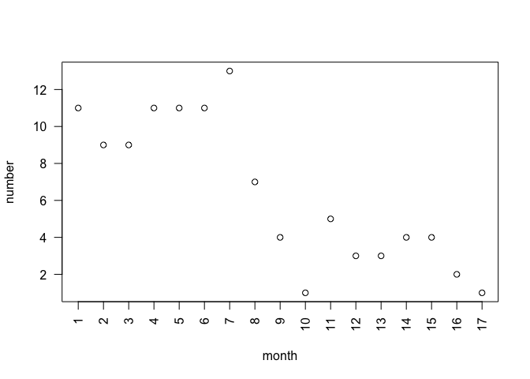
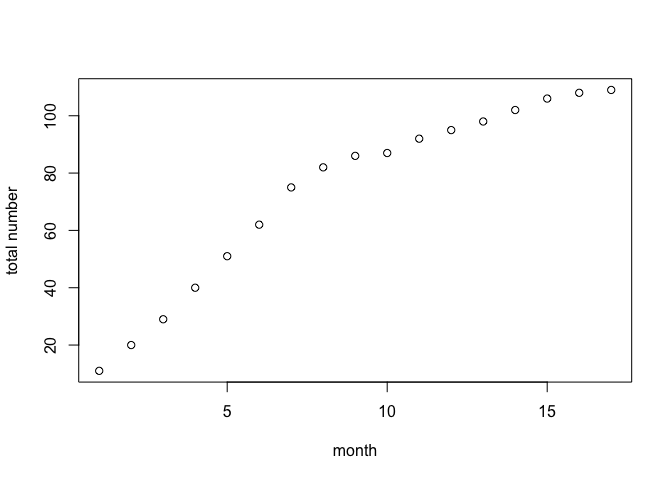

### 1.

    rm(list = ls())
    nodes <-read.csv("~/Desktop/R data/ckm_nodes.csv", header = TRUE )

    pres_tet <- rep(NA)
    for(i in 1 : length(unique(nodes$adoption)) - 2){
      pres_tet[i] <- length(which(nodes$adoption_date == i))
    }

    pres_tet[length(unique(nodes$adoption)) - 1] <- length(which(nodes$adoption_date == Inf))
    pres_tet[length(unique(nodes$adoption))    ] <- sum(is.na(nodes$adoption_date))
    pres_tet <- data.frame(t(pres_tet))
    colnames(pres_tet) <- c(1: (length(unique(nodes$adoption)) - 2), "Inf", "NA"); rownames(pres_tet) <- "number"
    pres_tet

    ##         1 2 3  4  5  6  7 8 9 10 11 12 13 14 15 16 17 Inf  NA
    ## number 11 9 9 11 11 11 13 7 4  1  5  3  3  4  4  2  1  16 121

### 2.

    index_not_NA <- which(is.na(nodes$adoption) == FALSE)
    length(index_not_NA)

    ## [1] 125

    nodes <- nodes[index_not_NA, ]

### 3.

    plot(c(1:17), pres_tet[ , c(1:17)], xaxt='n', xlab = "month", ylab = "number", las = 2)
    axis(side = 1, at = c(1:17), labels = T, las = 2)

    step_sum <- rep(NA)
    step_sum[1] <- pres_tet[1]
    for(i in 2:17){
      step_sum[i] <- step_sum[i-1] + pres_tet[i]
    }
    step_sum <- unlist(step_sum)
    plot(c(1:17), step_sum, xlab = "month", ylab = "total number")

### 4.

    logic_lesFeb <- nodes$adoption <= 2
    feb_doc <- which(logic_lesFeb)
    length(feb_doc)

    ## [1] 20

    logic_af14 <- nodes$adoption > 14
    af14_doc <- which(logic_af14)
    length(af14_doc)

    ## [1] 23

### 5.

    network <- read.table("~/Desktop/R data/ckm_network.txt")
    dim(network)

    ## [1] 246 246

    network <- network[index_not_NA, index_not_NA]
    dim(network)

    ## [1] 125 125

### 6.

    num_contact <- as.vector(apply(network, 2, sum))
    num_contact[41]

    ## [1] 3

### 7.

    logic_37 <- as.vector(network[37, ] == 1 & nodes$adoption_date <= 5)
    sum(logic_37 == TRUE)

    ## [1] 3

    sum(logic_37 == TRUE) / num_contact[37]

    ## [1] 0.6
