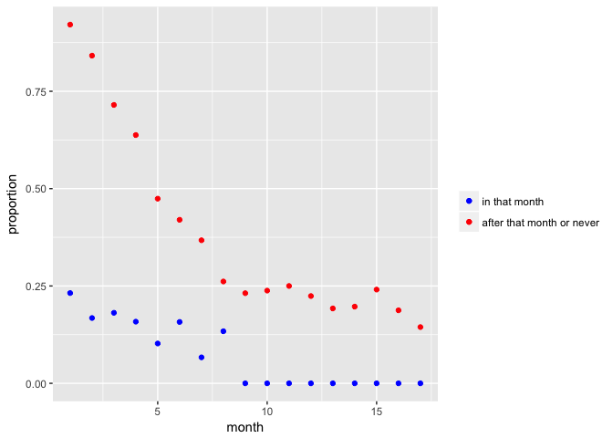

    nodes <- read.csv("~/Desktop/R data/ckm_nodes.csv", header = TRUE)
    index_not_na <- which(is.na(nodes$adoption_date) != TRUE)
    nodes <- nodes[index_not_na, ]

    network <- read.table("~/Desktop/R data/ckm_network.txt")
    network <- network[index_not_na, index_not_na]

### 1.

    adopters <- function(month, not_yet = NULL){
      if(is.null(not_yet)){
        vector <- which(nodes$adoption_date == month)  
      }
      else{
        vector <- which(nodes$adoption_date > month)
      }
      return(vector) 
    }

    length(adopters(2))

    ## [1] 9

    length(adopters(month = 14, not_yet = TRUE))

    ## [1] 23

### 2.

    num_contact <- as.vector(apply(network, 2, sum))
    num_contact[41]

    ## [1] 3

### 3.

    count_peer_pressure <- function(index, month){
      num_logic <- network[index, ] == 1 & nodes$adoption_date <= month
      return(sum(num_logic))
    } 

    count_peer_pressure(37, 5)

    ## [1] 3

### 4.

    prop_peer_pressure <- function(index, month){
      num <- count_peer_pressure(index, month)
      prop <- num / num_contact[index]
      return(prop)
    }
    prop_peer_pressure(37 , 5)

    ## [1] 0.6

    prop_peer_pressure(102, 14)

    ## [1] NaN

### 5.

    count_peer_pressure <- function(index, month){
      num_logic <- network[index, ] == 1 & nodes$adoption_date == month    # began in that month
      return(sum(num_logic))
    } 
    count_peer_pressure_2 <- function(index, month){
      num_logic <- network[index, ] == 1 & nodes$adoption_date > month     # later or never
      return(sum(num_logic))
    }
    prop_peer_pressure_2 <- function(index, month){                        # proportion of after that month or never
      num <- count_peer_pressure_2(index, month)
      prop <- num / num_contact[index]
      return(prop)
    }

    fun_que5 <- function(month){
      index <- adopters(month)
      prop <- unlist(lapply(index, prop_peer_pressure, month = month))
      mean_prop <- mean(prop, na.rm = TRUE)
      
      index_2 <- adopters(month, not_yet = TRUE)
      prop_2 <- unlist(lapply(index_2, prop_peer_pressure_2, month = month))
      mean_prop_L <- mean(prop_2, na.rm = TRUE)
      return(c(mean_prop, mean_prop_L))
    }

### 6.

    m <- c(1:17)
    res <- lapply(m, fun_que5)

    vec_1 <- rep(NA); vec_2 <- rep(NA)
    for(i in 1:17){
      vec_1[i] <- res[[i]][1]
      vec_2[i] <- res[[i]][2]
    }

    library(ggplot2)
    ggplot( mapping = aes(x = m)) + 
      geom_point(mapping = aes(y = vec_1, col = "in that month")) +
      geom_point(mapping = aes(y = vec_2, col = "after that month or never")) + 
      scale_colour_manual("", 
                          breaks = c("in that month", "after that month or never"),
                          values = c("red", "blue")) +
      xlab("month") + ylab("proportion")

Since all proportions of began in that month are always lower than the
proportion of after that month or never, the doctors who adopt in a
given month *do not* consistently have more contacts who are already
prescribing than non-adopters.
