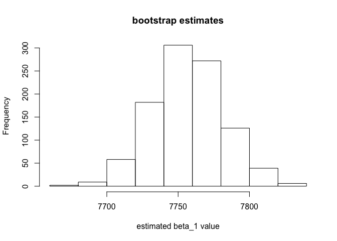

Instructions
============

Before you leave lab today make sure that you upload a knitted HTML file
to the canvas page (this should have a .html extension). No need to
upload the .Rmd file.

Part (A): Simple Linear Regression Model
----------------------------------------

1.  Import the **diamonds\_small.csv** dataset into R and store in a
    dataframe called **diamonds**. Use the **lm()** command to regress
    **price** (response) on *carat* (predictor) and save this result as
    **lm0**. What are the coefficients of **lm0**?

<!-- -->

    diamonds <- read.csv("~/Desktop/R data/diamonds-1.csv", header=T)
    lm0 <- lm(price~carat, data=diamonds)
    coef(lm0)

    ## (Intercept)       carat 
    ##   -2256.361    7756.426

Recall from lecture that the estimates $\\hat{\\beta}\_0$ and
$\\hat{\\beta}\_1$ that you just calculated with **lm()** are functions
of the data values and are therefore themselves are random (they inherit
variability from the data). If we were to recollect the diamonds data
over and over again, the estimates would be different each time.

In this lab we'll use bootstrapping to answer the following questions:
\begin{enumerate}
\item \textbf{``How much does $\hat{\beta}_1$ vary from one replication of the experiment to the other?"}
\item \textbf{``What are all the values of $\beta_1$ that would have produced this data with high probability?"}
\end{enumerate}
Part (B): How Does $\\hat{\\beta}\_1$ Vary?
-------------------------------------------

Strategy: we'll re-sample **(price, carat)** pairs in order to provide
an estimate for how $\\hat{\\beta}\_1$ varies across samples.

1.  How many rows are in the **diamonds** dataset? Call this value
    **n**.

<!-- -->

    n <- dim(diamonds)[1] 
    n

    ## [1] 53940

1.  We'll next use the **sample()** function to re-sample **n** rows of
    the **diamonds** dataset *with replacement*. The following code
    provides a single re-sample of the values 1, 2, …, *n*, or a single
    re-sample of the rows of the dataset.

<!-- -->

    resample1 <- sample(1:n, n, replace = TRUE)

Now write a loop to calculate **B &lt;- 1000** such re-samples and store
them as rows of the matrix **resampled\_values** which will have **B**
rows and **n** columns.

    B <- 1000
    resampled_values <- matrix(NA, nrow = B, ncol = n)
    for (b in 1:B) {
      resampled_values[b, ] <- sample(1:n, n, replace = TRUE)
    }

1.  Now we'll use each re-sampled dataset to provide a new estimate of
    $\\hat{\\beta}\_1$. Write a line of code that uses **resample1**
    above to produce a resamples dataset of **(price, carat)** pairs.
    Using the re-sampled dataset, use **lm()** to produce new estimates
    of $\\hat{\\beta}\_0$ and $\\hat{\\beta}\_1$. These values should be
    stored in a vector called **resample1\_ests**.

<!-- -->

    resample1_ests <- coef(lm(price~carat, data=diamonds[resample1,]))
    resample1_ests

    ## (Intercept)       carat 
    ##   -2246.895    7737.758

Hint: (a) Note that the following code produces the re-sampled dataset
from the re-sampled values:

    # resampled_data <- diamonds[resample1, ]
    # Remove the comment symbol in front of the above after resample1 is assigned in B(2)

1.  You'll probably want to use the **coefficients()** function.

<!-- -->

1.  Repeat the above call for each re-sampled dataset produced from the
    **resampled\_values** matrix. We'll store the new coefficient
    estimates in a matrix **resampled\_ests** with **B** rows and
    **2** columns. Again you'll want to write a loop, this time that
    iterates over the rows of **resampled\_values**. (Note that if you
    are very clever this could be done using **apply()**.) Make sure to
    print **head(resample\_ests)** at the end.

<!-- -->

    resampled_ests <- matrix(NA, nrow = B, ncol = 2)
    names(resampled_ests) <- c("Intercept_Est", "Slope_Est")
    for (b in 1:B) {
      coeff <- coef(lm(price~carat, data = diamonds[resampled_values[b,],]))
      resampled_ests[b,1] <- coeff[1]
      resampled_ests[b,2] <- coeff[2]
    }
    head(resampled_ests)

    ##           [,1]     [,2]
    ## [1,] -2278.227 7788.286
    ## [2,] -2250.451 7758.613
    ## [3,] -2260.610 7776.350
    ## [4,] -2259.246 7753.245
    ## [5,] -2249.042 7737.104
    ## [6,] -2254.902 7758.630

Hint: You may want to use multiple lines of code within the for loop.
One idea is to first use the rows corresponding to re-sample **b**
provided in **resampled\_values** to created a resampled dataset. Then
use the new dataset to provide new estimates of the coefficients.

1.  Recall from lecture that
    $(\\hat{\\beta}\_1^{(b)})\_{b=1}^B - \\hat{\\beta}\_1$ approximates
    the sampling distribution of $\\hat{\\beta}\_1 - \\beta\_1$ where
    *β*1 is the population parameter, $\\hat{\\beta}\_1$ is
    the estimate from out original dataset, and
    $(\\hat{\\beta}\_1^{(b)})\_{b=1}^B$ are the *B* bootstrap estimates.

Make a vector **diff\_estimates** that holds the differences between the
original estimate of $\\hat{\\beta}\_1$ from **lm0** and the bootstrap
estimates. It should have length **B**.

    diff_estimates <- coef(lm0)[2] - resampled_ests[,2]
    length(diff_estimates)

    ## [1] 1000

1.  Plot a histogram of the bootstrap estimates of $\\hat{\\beta}\_1$
    (they're in the \`Slope\_Est' column). Label the
    x-axis appropriately.

<!-- -->

    hist(resampled_ests[,2], main = "bootstrap estimates", xlab = "estimated beta_1 value")

1.  Calculate the standard deviation of the bootstrap estimates.

<!-- -->

    sd(resampled_ests[, 2])

    ## [1] 24.80867

Question 2: Bootstrap Confidence Intervals
==========================================

Finally we'd like to approximate confidence intervals for the regression
coefficients. Recall that a confidence interval is a random interval
which contains the truth with high probability (the confidence level).
If the confidence interval for *β*1 is C, and the confidence
level is 1 − *α*, then we want
*P**r*(*β*1 ∈ *C*)=1 − *α*
 no matter what the true value of *β*1.

We estimate the confidence interval from the bootstrap estimates by
finding a range of
$(\\hat{\\beta}\_1^{(b)})\_{b=1}^B - \\hat{\\beta}\_1$ which holds
1 − *a**l**p**h**a* percent of the values. In our case, let *α* = 0.05,
so we estmiate a confidence interval with level 0.95.

1.  Let **Cu** and **Cl** be the upper and lower limits of the
    confidence interval. Use the **quantile()** function to find the
    0.025 and 0.975 quantiles of the vector **diff\_estimates**
    calculated in B(5). Then **Cu** is the sum of the original estimate
    of $\\hat{\\beta}\_1$ from **lm0** with the upper quantile and
    **Cu** is the sum of the original estimate of $\\hat{\\beta}\_1$
    from **lm0** with the lower quantile.

<!-- -->

    Cl <- quantile(diff_estimates, probs = 0.025)
    Cu <- quantile(diff_estimates, probs = 0.975)
    int <- c(Cu, Cl)
    int

    ##     97.5%      2.5% 
    ##  48.71726 -51.16796
