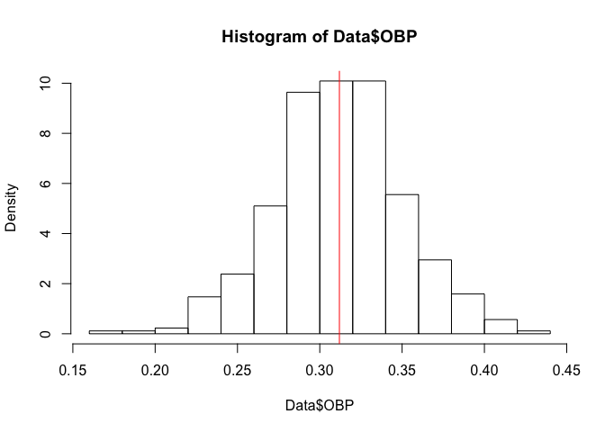
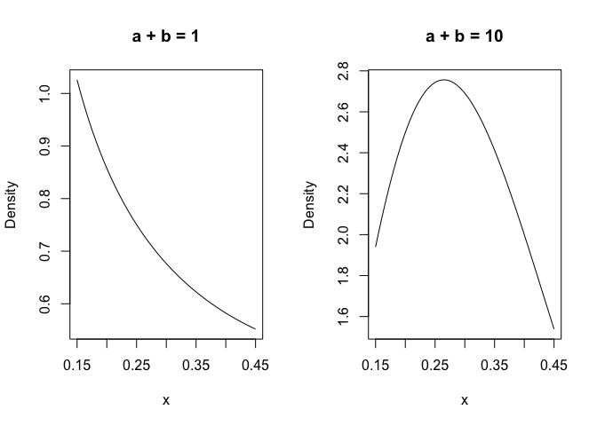
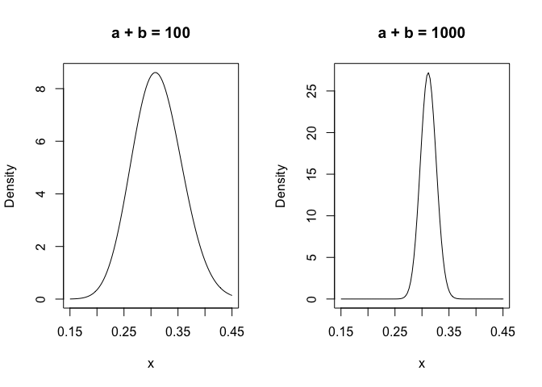
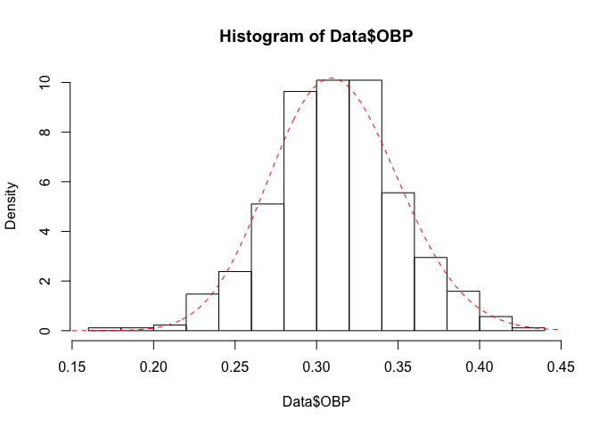
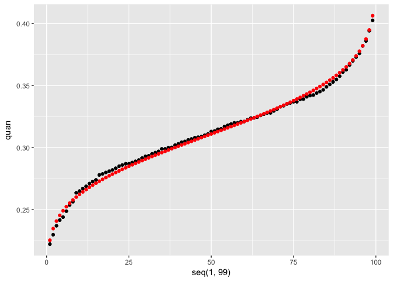

In today's lab we will use the Beta distribution to explore the
probability of reaching a base safely in baseball. The Beta is a random
variable bounded between 0 and 1 and often used to model the
distribution of proportions. The probability distribution function for
the Beta with parameters *α* and *β* is

$$ p(x|\\alpha, \\beta) = \\frac{\\Gamma (\\alpha + \\beta)}{\\Gamma (\\alpha) + \\Gamma(\\beta)} x^{\\alpha-1} (1-x)^{\\beta - 1} $$

where *Γ*() is the Gamma function, the generalized version of the
factorial. Thankfully, for this assignment, you need not know what the
Gamma function is; you need only know that the mean of a Beta is
$\\frac{\\alpha}{\\alpha + \\beta}$ and its variance is
$\\frac{\\alpha \\beta}{(\\alpha + \\beta)^2(\\alpha + \\beta + 1)}$.

For this assignment you will test the fit of the Beta distribution to
the on-base percentages (OBPs) of hitters in the 2014 Major League
Baseball season; each plate appearance (PA) results in the batter
reaching base or not, and this measure is the fraction of successful
attempts. This set has been pre-processed to remove those players with
an insufficient number of opportunities for success.

Part I
------

1.  Load the file `baseball.csv` into a variable of your choice in R.
    How many players have been included? What is the minimum number of
    plate appearances required to appear on this list? Who had the most
    plate appearances? What are the minimum, maximum, and mean OBP?

<!-- -->

    rm(list = ls())
    Data <- read.csv("~/Desktop/R data/baseball.csv", header = TRUE)
    num_players <- length(unique(Data$Name))
    min_PA <- min(Data$PA); max_PA <- max(Data$PA)
    max_PA_name <- Data[Data$PA == max_PA, "Name"]
    min_OBP <- min(Data$OBP); max_OBP <- max(Data$OBP); mean_OBP <- mean(Data$OBP)

    data.frame(num_players, min_PA, max_PA_name)

    ##   num_players min_PA max_PA_name
    ## 1         441    103 Ian Kinsler

    data.frame(min_OBP, max_OBP, mean_OBP)

    ##   min_OBP max_OBP  mean_OBP
    ## 1   0.168   0.432 0.3119184

1.  Plot the data as a histogram with the option `probability=TRUE`. Add
    a vertical line for the mean of the distribution. Does the mean
    coincide with the mode of the distribution?

<!-- -->

    hist(Data$OBP, prob = TRUE )
    lines(c(mean_OBP, mean_OBP), c(-1, 12), col = 2)

Yes. If we just look at the picture, the vertical mean line is located
at the "mean area" of the picture.

1.  Eyeball fit. Add a `curve()` to the plot using the density function
    `dbeta()`. Pick parameters *α* and *β* that match the mean of the
    distribution but where their sum equals 1. Add three more `curve()`s
    to this plot where the sum of these parameters equals 10, 100 and
    1000 respectively. Which of these is closest to the observed
    distribution?

<!-- -->

    par(mfrow=c(1,2))
    curve(dbeta(x, shape1 = mean_OBP, shape2 = 1 - mean_OBP), 
          from = 0.15, to = 0.45, main = "a + b = 1", ylab = "Density")
    curve(dbeta(x, shape1 = mean_OBP * 10, shape2 = 10 - (mean_OBP* 10)), 
          from = 0.15, to = 0.45, main = "a + b = 10", ylab = "Density")

    curve(dbeta(x, shape1 = mean_OBP * 100, shape2 = 100 - (mean_OBP* 100)), 
          from = 0.15, to = 0.45, main = "a + b = 100", ylab = "Density")
    curve(dbeta(x, shape1 = mean_OBP * 1000, shape2 = 1000 - (mean_OBP* 1000)), 
          from = 0.15, to = 0.45, main = "a + b = 1000", ylab = "Density")

Compare with the last plot, when *a* + *b* = 100, the plot is closest to
the observed distribution.

Part II
-------

1.  Method of moments fit. Find the calculation for the parameters from
    the mean and variance and solve for *α* and *β*. Create a new
    density histogram and add this `curve()` to the plot. How does it
    agree with the data?

<!-- -->

    beta_mean <- function(a, b){
      return(a / (a + b))
    }
    beta_variance <- function(a, b){
      return((a*b) / (((a + b)^2) * (a + b + 1) ))
    }
    beta_diff <- function(parm, data){
      a <- parm[1]
      b <- parm[2]
      return((mean(data) - beta_mean(a,b))^2 + (var(data) - beta_variance(a, b))^2)
    }
    (paras_hat <- nlm(beta_diff, c(0.05,0.99), data = Data$OBP)$estimate)

    ## [1] 43.50643 95.97350

    hist(Data$OBP, prob = TRUE)
    curve(dbeta(x, shape1 = paras_hat[1], shape2 = paras_hat[2]), 
                n = length(Data$OBP), from = 0.15, to = 0.45,
          main = "estimate", ylab = "Density", add = TRUE, col = 2, lty = 2)

We can see that the curve almost fits the data we have.

1.  Calibration. Find the 100 percentiles of the actual distribution of
    the data using the `quantile()` function using
    `quantile(bb$OBP, probs = seq(1, 100)/100)` and plot them against
    the 100 percentiles of the beta distribution you just fit using
    `qbeta()`. How does the fit appear to you?

<!-- -->

    quan <- quantile(Data$OBP, probs = seq(1, 99)/100)
    fit <- qbeta(p = seq(1, 99)/100, shape1 = paras_hat[1], shape2 = paras_hat[2])
    library(ggplot2)
    ggplot() + 
      geom_point(mapping = aes(x = seq(1, 99), y = quan)) + 
      geom_point(mapping = aes(x = seq(1, 99), y = fit),  col = 2)

Most of data fits very well.

1.  Optional if you have time -- MLE fit. Create a function for the
    log-likelihood of the distribution that calculates
    `-sum(dbeta(your.data.here, your.alpha, your.beta, log = TRUE))` and
    has one argument `params = c(your.alpha, your.beta)`. Use `nlm()` to
    find the minimum of the negative of the log-likelihood. Take the
    Method of Moments fit for your starting position. How do these
    values compare?

<!-- -->

    neg_beta_MLE <- function(params, data){
      a <- params[1]
      b <- params[2]
      neg_sum <- -sum(dbeta(data, a, b, log = TRUE))
      return(neg_sum)
    }
    nlm(neg_beta_MLE, p = c(1,1), data = Data$OBP)$estimate

    ## [1] 43.73905 96.49870

    paras_hat

    ## [1] 43.50643 95.97350

Compare the estimates we got from the method of moment and the estimates
by MLE method, we can say they have a very closed estimation for
parameters.
